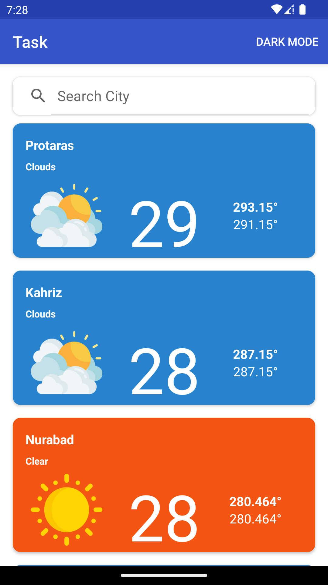
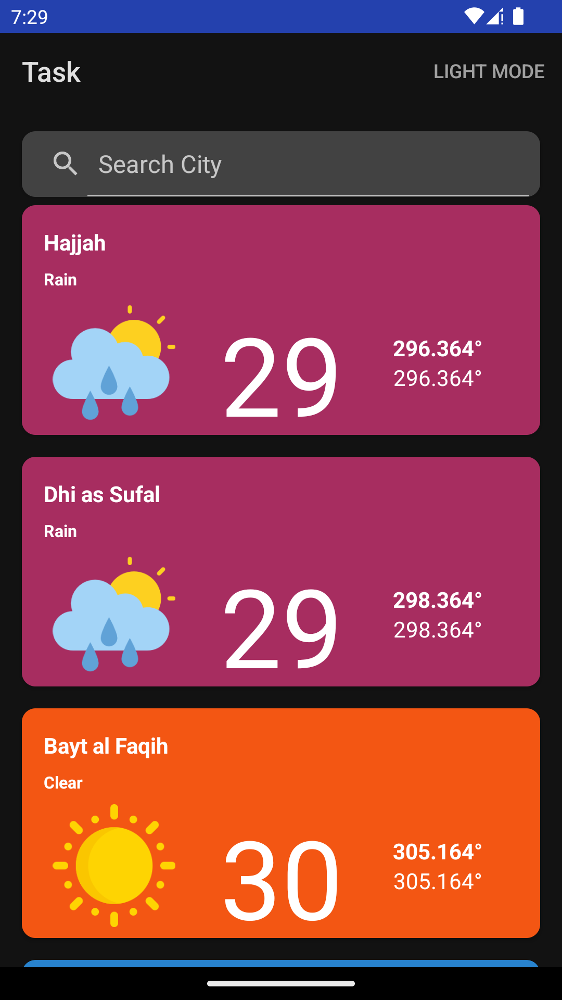

# This is task for creating a simple weather application

The design pattern used in this app is **MVVM**. 

It is created using Android Architecture components such as **ViewModel**, **LiveData**, **Room**, **Paging 3.0** for recyclerview, It also uses **Coroutines** for API call and Fetching data from local db. 

For Dependency Injection **Dagger-Hilt** is used

For API calls **Retrofit** is used with custom **Interceptor** to unzip **.gz** downloaded from API and extract the Json, Then convert new-line delimited Json to simple json format to create a data class. That data class is then stored in local database using **Room** so that the pagination and searching can be implemented easily. For Pagination, Android **Paging 3.0** Library is used. 

The app will show progress bar and take time only on the first launch of application to load data from remote server. Once it's downloaded, It will be stored locally for future use, and the recyclerview will be populated instantly without any delay on second launch of app.

 

    
    

 
